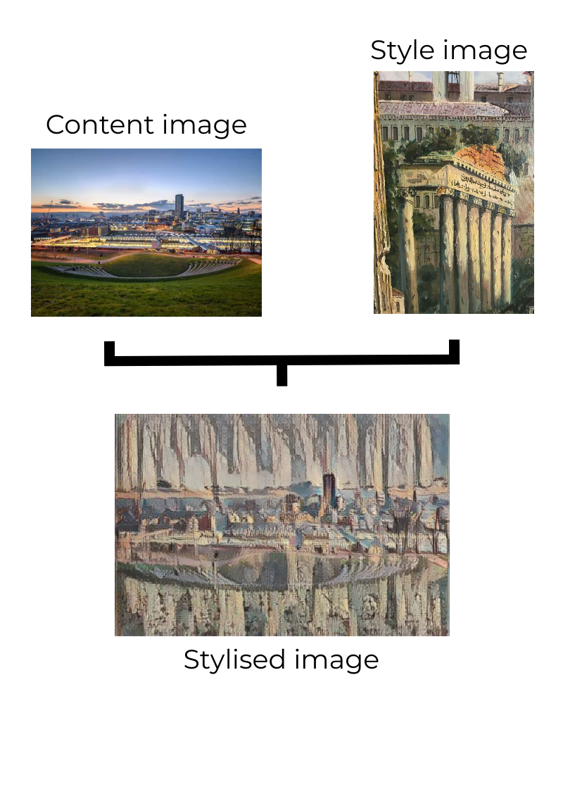

# A brief introduction to neural style transfer

A Python module to explore the neural style transfer capabilities of Google Magneta.

Developed and tested in Python 3.8

## How do I get set up?

Make sure you have Git installed - [Download Git](https://git-scm.com/downloads)

Install Python - [Download Python](https://www.python.org/downloads/)

* Clone this repository to your local machine
* Install the requirements:

```
>> cd <git-repo-root-dir>
>> pip install -r requirements.txt
```

Check that the installation was successful by running the following command from terminal / command-line:

```
>> python .\google_magenta_example.py -h
```

This will print the helper for the command line interface which can be useful for working interactively:

```
usage: google_magenta_example.py [-h] -c </path/to/content-image> -s
                                 </path/to/style-image>

This is the CLI for the google_magenta_example module

optional arguments:
  -h, --help            show this help message and exit
  -c </path/to/content-image>, --content-image </path/to/content-image>
                        Specify path to content image file.
  -s </path/to/style-image>, --style-image </path/to/style-image>
                        Specify path to style image file.

Ethan Jones, 2021-08-31
```

## What is Magenta?

Google Magenta is the model we'll use to apply the style transfer without having to train our own - we'll make use of the version on [TensorFlow Hub](https://www.tensorflow.org/hub).
Magenta is a open-source research project exploring the role of machine learning in the process of creating art and music.

Explore Magenta further - [Project website](https://magenta.tensorflow.org/)

Magenta repo - [Github repo](https://github.com/magenta/magenta)

## What is neural style transfer?

Neural style transfer is a way of manipulating images or other media to alter the appearance to that of another image.

The neural network takes two images as inputs (one referred to as the content image and the other as the style image) - the content image acts as the base image to which we'll apply the style from the style image.

As for the underlying network itself, the network contains a 'bottleneck' in the middle-most hidden layer. 
This 'bottleneck' acts as the boundary between the encoding and decoding processes -
the encoding process is where the style image is broken down to its features and the decoding process 
is where the content image is built up using such features.

For a deeper explanation of the archiecture - [Towards Data Science article](https://towardsdatascience.com/light-on-math-machine-learning-intuitive-guide-to-neural-style-transfer-ef88e46697ee)

## Example output


